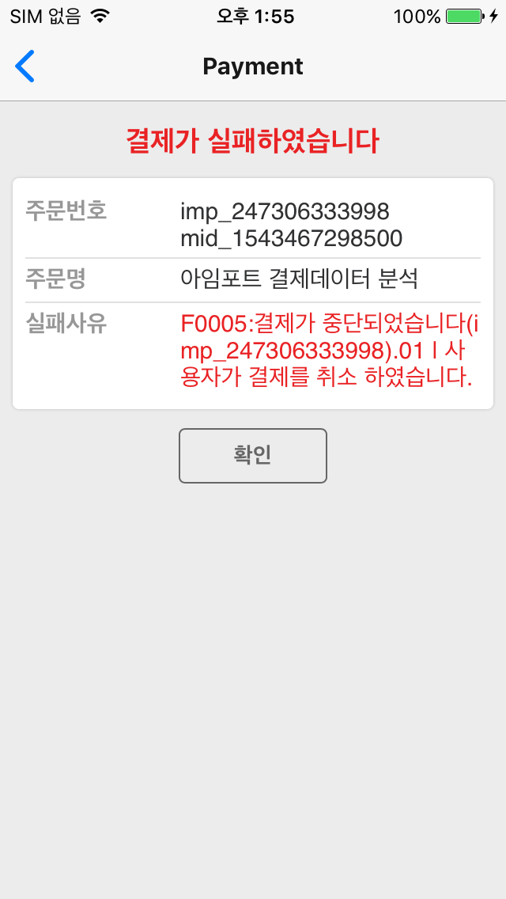

# iamport-react-native
[  ](https://github.com/facebook/react/)
[  ](https://github.com/facebook/react-native)
[  ](https://github.com/sindresorhus/query-string)

리액트 네이티브용 아임포트 모듈 콜백 설정 안내입니다.

## 콜백 함수 설정하기
#### 1. 콜백은 필수입력
콜백 함수는 필수입력 필드로, 결제/본인인증 완료 후 실패/성공 여부에 맞게 로직을 작성할 수 있습니다.
<b>콜백 함수를 설정하지 않으면, 결제/본인인증 완료 후 아래와 같이 아임포트가 기본적으로 제공하는 페이지(PG사에 따라 로딩화면이 보여지는 경우도 있음)로 넘어가게 됩니다.</b>
따라서 <span style="color: #f5222d">반드시 callback 함수를 설정</span>해주어야 합니다.




#### 2. 콜백 함수 작성하기
결제/본인인증 완료 후 [react-navigation](https://github.com/react-navigation/react-navigation)를 통해 라우터를 변경하는 경우, 아래와 같이 [push 함수](https://reactnavigation.org/docs/en/stack-actions.html#push)가 아닌 [replace 함수](https://reactnavigation.org/docs/en/stack-actions.html#replace)를 사용해야 합니다.
push 함수를 사용할 경우, 결제 완료 후 라우터가 변경되더라도 유저가 뒤로가기를 했을 경우 아임포트 모듈이 다시 렌더링됩니다. 하지만 replace 함수를 사용하면, 결제 완료 후 라우터가 변경되고 유저가 뒤로가기를 하면 원래 결제화면으로 넘어가게 됩니다.

### 잘못된 사용 예제
```javascript
function callback(response) {
  navigation.push('Result', response); // [에러] push 함수 사용
}
```

### 올바른 사용 예제
```javascript
function callback(response) {
  navigation.replace('Result', response);
}
```

#### 3. 결과에 따라 로직 작성하기
콜백 함수의 첫번째 인자(response)는 결제/본인인증 결과를 담고 있는 오브젝트로 아래와 같이 구성되어 있습니다.

| key           |  Description       | 
| ------------- | ------------------ | 
| success       | 성공 여부            |
| imp_uid       | 아임포트 번호         |
| merchant_uid  | 주문번호             |
| error_msg     | 실패한 경우, 에러메시지  |

response에 따라 결제/본인인증 성공/실패 여부를 판단해 아래와 같이 각기 다른 로직을 구성할 수 있습니다.

```javascript
// Result.js
const success = navigation.getParam('success');
const imp_uid = navigation.getParma('imp_uid');
const merchant_uid = navigation.getParma('merchant_uid');

return (
  <View style={container}>
    <Text>{`결제/본인인증에 ${success ? '성공' : '실패'}하였습니다.`}</Text>
    <View style={table}>
      <View style={row}>
        <Text style={name}>아임포트 번호</Text>
        <Text style={value}>{imp_uid || '없음'}</Text>
      </View>
      <View style={row}>
        <Text style={name}>주문 번호</Text>
        <Text style={value}>{merchant_uid || '없음'}</Text>
      </View>
      {
        !success && 
        <View style={row}>
          <Text style={name}>에러 메시지</Text>
          <Text style={value}>{error_msg || '없음'}</Text>
        </View>
      }
    </View>
  </View>
);
...
```