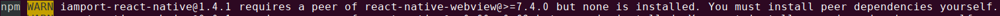

# iamport-react-native
[  ](https://github.com/facebook/react/)
[  ](https://github.com/facebook/react-native)
[  ](https://github.com/sindresorhus/query-string)
[  ](https://github.com/react-native-community/react-native-webview)

아임포트 리액트 네이티브 모듈입니다. 웹 페이지를 리액트 네이티브에서 웹뷰로 띄워 재사용 하는 경우, [아임포트 리액트 네이티브 웹뷰](exampleForWebView/README.md) 문서를 참고해주세요.
EXPO 환경인 경우, [엑스포에서 아임포트 연동하기](manuals/EXPO.md) 문서를 참고해주세요.

## 목차
- [버전정보](manuals/VERSION.md)
- [지원정보](manuals/SUPPORT.md)
- [설치하기](manuals/INSTALL.md)
- 설정하기
  - [IOS 설정하기](manuals/SETTING.md)
  - AndroidX 설정하기
  - [실시간 계좌이체 설정하기](manuals/TRANS.md)
- [예제](manuals/EXAMPLE.md)
- [콜백 함수 설정하기](manuals/CALLBACK.md)

## 버전정보
최신버전은 [v1.6.4](https://github.com/iamport/iamport-react-native/tree/master)입니다. 버전 히스토리는 [버전정보](manuals/VERSION.md)를 참고하세요.

## 지원정보
아임포트 리액트 네이티브 모듈은 결제 및 휴대폰 본인인증 기능을 제공합니다. 결제시 지원하는 PG사와 결제수단에 대한 자세한 정보는 [지원정보](manuals/SUPPORT.md)를 참고하세요. 

## 설치하기
아래 명령어를 통해 아임포트 모듈을 귀하의 리액트 네이티브 프로젝트에 추가할 수 있습니다. `react-native-webview` 모듈은 아임포트 모듈에 dependent하기 때문에 반드시 함께 설치해야 하며 **10.8.3 이상의 버전이 요구**됩니다. 보다 자세한 안내는 [설치하기](manuals/INSTALL.md)를 참고하세요.

```
$ npm install iamport-react-native --save
```

`iamport-react-native` 는 `v10.8.3` 이상의 `react-native-webview` 를 필요로 합니다.
위 명령어대로 iamport-react-native 플러그인을 설치했을 때 다음과 같은 Warning Message 가 나온다면 기존에 설치된 `react-native-webview` 플러그인을 업데이트해주세요.


  

아래 다음 명령어를 통해 아임포트 모듈을 귀하의 안드로이드/IOS 프로젝트에 추가할 수 있습니다.

```
$ npm install -g react-native-cli
$ react-native link iamport-react-native
$ react-native link react-native-webview
```

## 설정하기
### IOS 설정하기
IOS에서 아임포트 결제연동 모듈을 사용하기 위해서는 아래 3가지 항목을 설정해주셔야 합니다. 보다 자세한 설명은 [IOS 설정하기](manuals/SETTING.md)를 참고하세요.

#### 1. App Scheme 등록
외부 결제 앱(예) 페이코, 신한 판 페이)에서 결제 후 돌아올 때 사용할 URL identifier를 설정해야합니다.


#### 2. 외부 앱 리스트 등록
3rd party앱(예) 간편결제 앱)을 실행할 수 있도록 외부 앱 리스트를 등록해야합니다. 

```html
<key>LSApplicationQueriesSchemes</key>
<array>
  <string>kftc-bankpay</string> <!-- 계좌이체 -->
  <string>ispmobile</string> <!-- ISP모바일 -->
  <string>itms-apps</string> <!-- 앱스토어 -->
  <string>hdcardappcardansimclick</string> <!-- 현대카드-앱카드 -->
  <string>smhyundaiansimclick</string> <!-- 현대카드-공인인증서 -->
  <string>shinhan-sr-ansimclick</string> <!-- 신한카드-앱카드 -->
  <string>smshinhanansimclick</string> <!-- 신한카드-공인인증서 -->
  <string>kb-acp</string> <!-- 국민카드-앱카드 -->
  <string>mpocket.online.ansimclick</string> <!-- 삼성카드-앱카드 -->
  <string>ansimclickscard</string> <!-- 삼성카드-온라인결제 -->
  <string>ansimclickipcollect</string> <!-- 삼성카드-온라인결제 -->
  <string>vguardstart</string> <!-- 삼성카드-백신 -->
  <string>samsungpay</string> <!-- 삼성카드-삼성페이 -->
  <string>scardcertiapp</string> <!-- 삼성카드-공인인증서 -->
  <string>lottesmartpay</string> <!-- 롯데카드-모바일결제 -->
  <string>lotteappcard</string> <!-- 롯데카드-앱카드 -->
  <string>cloudpay</string> <!-- 하나카드-앱카드 -->
  <string>nhappcardansimclick</string> <!-- 농협카드-앱카드 -->
  <string>nonghyupcardansimclick</string> <!-- 농협카드-공인인증서 -->
  <string>citispay</string> <!-- 씨티카드-앱카드 -->
  <string>citicardappkr</string> <!-- 씨티카드-공인인증서 -->
  <string>citimobileapp</string> <!-- 씨티카드-간편결제 -->
  <string>kakaotalk</string> <!-- 카카오톡 -->
  <string>payco</string> <!-- 페이코 -->
  <string>lpayapp</string> <!-- 롯데 L페이 -->
  <string>hanamopmoasign</string> <!-- 하나카드 공인인증앱 -->
  <string>wooripay</string> <!-- 우리페이 -->
  <string>nhallonepayansimclick</string> <!-- NH 올원페이 -->
  <string>hanawalletmembers</string> <!-- 하나카드(하나멤버스 월렛) -->
</array>
```


#### 3. App Transport Security 설정


```html
<key>NSAppTransportSecurity</key>
<dict>
  <key>NSAllowsArbitraryLoadsInWebContent</key>
  <true/>
  <key>NSAllowsArbitraryLoads</key>
  <true/>
</dict>
```

## AndroidX 설정하기
AndroidX를 사용하시는 경우 추가 설정이 필요합니다. AndroidX를 사용하려면, 컴파일 SDK를 Android 9.0(API 레벨 28)이상으로 설정하고 android/gradle.properties 파일에 아래 두 Android Gradle 플러그인 플래그를 `true`로 설정해야 합니다.

```
// android/gradle.properties
android.useAndroidX=true
android.enableJetifier=true
```

iamport-react-native 모듈은 네이티브 코드를 포함하기 때문에 이 또한 AndroidX로 변형해야 합니다. 이를 위해 [jetifier](https://github.com/mikehardy/jetifier)를 사용합니다. jetifier는 리액트 네이티브 버전 0.60 이상에서는 자동으로 포함되어 있기 때문에 0.59 이하 버전을 사용하는 경우에만 아래 코드를 실행해주세요.

```
npm install --save-dev jetifier
npx jetifier
```

### 실시간 계좌이체 설정하기
웹 표준 이니시스와 나이스 정보통신은 뱅크페이 앱을 통해 실시간 계좌이체를 진행합니다. 뱅크페이에서 결제 인증 후 본래의 앱으로 복귀 해 다음단계로 진행을 하려면 별도 설정이 요구됩니다. 자세한 내용은 [실시간 계좌이체 설정하기](manuals/TRANS.md)를 참고해주세요.


## 예제
아임포트 결제연동 모듈을 사용해 아래와 같이 일반/정기결제 및 휴대폰 본인인증 기능을 구현할 수 있습니다. 필요한 파라미터는 [예제](manuals/EXAMPLE.md)를 참고하세요.

#### 일반/정기결제 예제

##### JavaScript  

```javascript
import React from 'react';
/* 아임포트 모듈을 불러옵니다. */
import IMP from 'iamport-react-native';

/* 로딩 컴포넌트를 불러옵니다. */
import Loading from './Loading';

export function Payment({ navigation }) {
  /* [필수입력] 결제 종료 후, 라우터를 변경하고 결과를 전달합니다. */
  function callback(response) {
    navigation.replace('PaymentResult', response);
  }

  /* [필수입력] 결제에 필요한 데이터를 입력합니다. */
  const data = {
    pg: 'html5_inicis',
    pay_method: 'card',
    name: '아임포트 결제데이터 분석',
    merchant_uid: `mid_${new Date().getTime()}`,
    amount: '39000',
    buyer_name: '홍길동',
    buyer_tel: '01012345678',
    buyer_email: 'example@naver.com',
    buyer_addr: '서울시 강남구 신사동 661-16',
    buyer_postcode: '06018',
    app_scheme: 'example',
    // [Deprecated v1.0.3]: m_redirect_url
  };

  return (
    <IMP.Payment
      userCode={'iamport'}  // 가맹점 식별코드
      tierCode={'AAA'}      // 티어 코드: agency 기능 사용자에 한함
      loading={<Loading />} // 웹뷰 로딩 컴포넌트
      data={data}           // 결제 데이터
      callback={callback}   // 결제 종료 후 콜백
    />
  );
}

export default Payment;
```

##### TypeScript

```javascript
import React from 'react';
/* 아임포트 모듈을 불러옵니다. */
import IMP from 'iamport-react-native';

/* 로딩 컴포넌트를 불러옵니다. */
import Loading from './Loading';

export function IamportPayment() {
  function callback(response) {
    // navigation 을 이용해 결과 렌더링 Component로 이동
  }

  /* [필수입력] 결제에 필요한 데이터를 생성합니다. */
  const data = {
    pg: 'html5_inicis',
    pay_method: 'card',
    name: '아임포트 결제데이터 분석',
    merchant_uid: `mid_${new Date().getTime()}`,
    amount: '39000',
    buyer_name: '홍길동',
    buyer_tel: '01012345678',
    buyer_email: 'example@naver.com',
    buyer_addr: '서울시 강남구 신사동 661-16',
    buyer_postcode: '06018',
    app_scheme: 'example',
    // [Deprecated v1.0.3]: m_redirect_url
  };

  return (
    <IMP.Payment
      userCode={'iamport'}  // 가맹점 식별코드
      tierCode={'AAA'}      // 티어 코드: agency 기능 사용자에 한함
      loading={<Loading />} // 웹뷰 로딩 컴포넌트
      data={data}           // 결제 데이터
      callback={callback}   // 결제 종료 후 콜백
    />
  );
}

export default IamportPayment;
```


#### 휴대폰 본인인증 예제

##### JavaScript

```javascript
import React from 'react';
/* 아임포트 모듈을 불러옵니다. */
import IMP from 'iamport-react-native';
/* 로딩 컴포넌트를 불러옵니다. */
import Loading from './Loading';

export function Certification({ navigation }) {
  /* [필수입력] 본인인증 종료 후, 라우터를 변경하고 결과를 전달합니다. */
  function callback(response) {
    navigation.replace('CertificationResult', response);
  }

  /* [필수입력] 본인인증에 필요한 데이터를 입력합니다. */
  const data = {
    merchant_uid: `mid_${new Date().getTime()}`,
    company: '아임포트',
    carrier: 'SKT',
    name: '홍길동',
    phone: '01012341234',
    min_age: '',
  };

  return (
    <IMP.Certification
      userCode={'iamport'}  // 가맹점 식별코드
      tierCode={'AAA'}      // 티어 코드: agency 기능 사용자에 한함
      loading={<Loading />} // 웹뷰 로딩 컴포넌트
      data={data}           // 본인인증 데이터
      callback={callback}   // 본인인증 종료 후 콜백
    />
  );
}

export default Certification;
```

##### TypeScript

```javascript
import React from 'react';
/* 아임포트 모듈을 불러옵니다. */
import IMP from 'iamport-react-native';

/* 로딩 컴포넌트를 불러옵니다. */
import Loading from './Loading';

export function IamportCertification() {
  function callback(response) {
    // navigation 을 이용해 결과 렌더링 Component로 이동
  }

  /* [필수입력] 본인인증에 필요한 데이터를 생성합니다. */
  const data = {
    merchant_uid: `mid_${new Date().getTime()}`,
    company: '아임포트',
    carrier: 'SKT',
    name: '홍길동',
    phone: '01012341234',
    min_age: 19,
  };

  return (
    <IMP.Certification
      userCode={'iamport'}  // 가맹점 식별코드
      tierCode={'AAA'}      // 티어 코드: agency 기능 사용자에 한함
      loading={<Loading />} // 웹뷰 로딩 컴포넌트
      data={data}           // 본인인증 데이터
      callback={callback}   // 본인인증 종료 후 콜백
    />
  );
}

export default IamportCertification;
```

#### 웹뷰 로딩 컴포넌트 예제
```javascript
import React from 'react';
import { View, Text, StyleSheet } from 'react-native';

export function Loading() {
  const { container } = styles;
  return (
    <View style={container}>
      <Text>잠시만 기다려주세요...</Text>
    </View>  
  );
}

const styles = StyleSheet.create({
  container: {
    ...StyleSheet.absoluteFillObject,
  },
});

export default Loading;
```

## 콜백 함수 설정하기
콜백 함수는 필수입력 필드로, 결제/본인인증 완료 후 라우트 이동을 위해 아래와 같이 로직을 작성할 수 있습니다. 콜백 함수에 대한 자세한 설명은 [콜백 설정하기](manuals/CALLBACK.md)를 참고하세요.

```javascript
function callback(response) {
  navigation.replace('Result', response);
}
```
