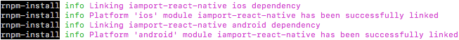

# iamport-react-native
[  ](https://github.com/facebook/react/)
[  ](https://github.com/facebook/react-native)
[  ](https://github.com/sindresorhus/query-string)

리액트 네이티브용 아임포트 결제연동 모듈입니다.


## 버전 정보
- [v0.8.0](https://github.com/iamport/iamport-react-native/tree/v0.8.0)
  - stable 버전으로 안드로이드만 지원합니다.
  - 일반/정기결제 기능만 제공합니다.

- [v1.0.0](https://github.com/iamport/iamport-react-native/tree/master) 
  - beta 버전으로 안드로이드와 IOS 모두 지원합니다. 현재 정식 버전으로 패치를 위한 테스트를 진행 중입니다.
  - 일반/정기결제 및 휴대폰 본인인증 기능을 제공합니다.


## 설치
아래 명령어를 통해 아임포트 모듈을 귀하의 리액트 네이티브 프로젝트에 추가할 수 있습니다.

```
  $ npm install iamport-react-native --save
```

아래 다음 명령어를 통해 아임포트 모듈을 귀하의 안드로이드/IOS 프로젝트에 추가할 수 있습니다.

```
  $ npm install -g react-native-cli
  $ react-native link iamport-react-native
```

성공적으로 마쳤을 경우, 아래와 같은 화면을 보실 수 있습니다.



실패한 경우, 아래 과정을 통해 iamport-react-native 모듈을 귀하의 프로젝트에 [수동으로 연결](https://facebook.github.io/react-native/docs/linking-libraries-ios)시킬 수 있습니다.

#### IOS

1. XCode 프로젝트(`[...]/ios/[...].xcodeproj`)를 더블클릭해 오픈합니다.
2. 왼쪽 프로젝트 네비게이터에서, `Libraries` 폴더를 마우스 오른쪽 클릭 ➜ `Add Files to [your project's name]`를 클릭합니다.
3. `[...]/node_modules/iamport-react-native/ios/IamportReactNative.xcodeproj`를 선택해 추가합니다.
4. 왼쪽 프로젝트 네비게이터에서, 귀하의 프로젝트를 클릭 ➜ 오른쪽 상단 `Build Settings`를 클릭합니다.
5. 세번째 메뉴인 `Link Binary With Libraries`를 열어 `libIamportReactNative.a` 파일을 추가합니다.

#### 안드로이드

1. `android/app/src/main/java/[...]/MainApplication.java` 파일을 열어 아래 코드를 추가합니다.
  ```java
    import com.iamport.IamportPackage; // 아임포트 패키지를 불러옵니다.

    ...

    @Override
    protected List<ReactPackage> getPackages() {
      return Arrays.<ReactPackage>asList(
          new MainReactPackage(),
            new IamportPackage() // 아임포트 패키지를 추가합니다.
      );
    }
  ```

2. `android/settings.gradle` 파일을 열고 아래 코드를 추가합니다.
  ```java
    ...

    include ':iamport-react-native'
    project(':iamport-react-native').projectDir = new File(rootProject.projectDir,  '../node_modules/iamport-react-native/android')

    ...
  ```

3. `android/app/build.gradle` 파일을 열고 아래 코드를 추가합니다.
  ```java
    dependencies {
        ...

        compile project(':iamport-react-native')

        ...
    }
  ```


## 설정(IOS)
#### 1. App Scheme 등록
외부 결제 앱(예) 페이코, 신한 판 페이)에서 결제 후 돌아올 때 사용할 URL identifier를 설정해야합니다.

1. `[프로젝트 폴더]/ios/[프로젝트 이름]/info.plist` 파일을 연 후 `URL types`속성을 추가합니다.
2. item `0`를 확장하여 `URL schemes`를 선택합니다.
3. item `0`에 App Scheme을 작성합니다.


#### 2. 외부 앱 리스트 등록
3rd party앱(예) 간편결제 앱)을 실행할 수 있도록 외부 앱 리스트를 등록해야합니다. 
1. `[프로젝트 폴더]/ios/[프로젝트 이름]/info.plist` 파일을 오픈합니다.
2. [LSApplicationQueriesSchemes](https://developer.apple.com/library/content/documentation/General/Reference/InfoPlistKeyReference/Articles/LaunchServicesKeys.html#//apple_ref/doc/uid/TP40009250-SW14)속성을 추가하고 아래에 외부 앱 리스트를 등록합니다.
```javascript
<key>LSApplicationQueriesSchemes</key>
<array>
  <string>kakao0123456789abcdefghijklmn</string>
  <string>kakaokompassauth</string>
  <string>storykompassauth</string>
  <string>kakaolink</string>
  <string>kakaotalk</string>
  <string>kakaostory</string>
  <string>storylink</string>
  <string>payco</string>
  <string>kftc-bankpay</string>
  <string>ispmobile</string>
  <string>itms-apps</string>
  <string>hdcardappcardansimclick</string>
  <string>smhyundaiansimclick</string>
  <string>shinhan-sr-ansimclick</string>
  <string>smshinhanansimclick</string>
  <string>kb-acp</string>
  <string>mpocket.online.ansimclick</string>
  <string>ansimclickscard</string>
  <string>ansimclickipcollect</string>
  <string>vguardstart</string>
  <string>samsungpay</string>
  <string>scardcertiapp</string>
  <string>lottesmartpay</string>
  <string>lotteappcard</string>
  <string>cloudpay</string>
  <string>nhappvardansimclick</string>
  <string>nonghyupcardansimclick</string>
  <string>nhallonepayansimclick</string>
  <string>citispay</string>
  <string>citicardappkr</string>
  <string>citimobileapp</string>
  <string>itmss</string>
  <string>lpayapp</string>
  <string>kpay</string>
</array>
```


#### 3. App Transport Security 설정

1. `[프로젝트 폴더]/ios/[프로젝트 이름]/info.plist` 파일을 오픈합니다.
2. `App Transport Security` 속성을 추가합니다.
3. 하부 속성에 `Allow Arbitrary Loads in Web Content`,`Allow Arbitrary Loads` 속성을 추가하고 각각의 값(value)을 `YES`로 변경합니다.
4. 설정된 결과는 아래와 같습니다.
```javascript
<key>NSAppTransportSecurity</key>
<dict>
  <key>NSAllowsArbitraryLoadsInWebContent</key>
  <true/>
  <key>NSAllowsArbitraryLoads</key>
  <true/>
</dict>
```


## 예제 프로젝트
#### IOS
##### 1. 디바이스
  - [XCode를 설치](https://developer.apple.com/xcode)합니다.
  - IOS 디바이스를 컴퓨터에 연결합니다.
  - XCode 프로젝트(`[...]/node_modules/iamport-react-native/example/ios/example.xcodeproj`)를 더블클릭해 오픈합니다.
  - `Cmd+R`를 눌러 앱을 빌드합니다.
  - 빌드가 성공하고 디바이스에 example 앱이 설치된 것을 확인하실 수 있습니다.

##### 2. Emulator
  - 아래 명령어를 입력해 IOS emulator를 실행시켜 아임포트 모듈 결제테스트를 진행하실 수 있습니다.
  ```
    $ cd [...]/node_modules/iamport-react-native/example
    $ npm install
    $ react-native run-ios
  ```

#### 안드로이드
##### 1. 디바이스
  - 안드로이드 디바이스를 컴퓨터에 연결합니다.
  - 아래 명령어를 입력해 앱을 빌드합니다.
    ```
    $ cd [...]/node_modules/iamport-react-native/example
    $ npm install
    $ react-native run-android
    ```
  - 빌드가 성공하고 example 앱이 디바이스에 설치된 것을 확인하실 수 있습니다.

##### 2. Emulator
  - [안드로이드 스튜디오를 설치](https://developer.android.com/studio)합니다.
  - 안드로이드 프로젝트(`[...]/node_modules/iamport-react-native/example/android`)를 안드로이드 스튜디오에서 오픈합니다.
  -  또는 `Cmd+F9`를 눌러 앱을 빌드합니다.
  - 을 눌러 안드로이드 emulator를 실행시킵니다.
  - example 앱이 설치된 것을 확인하실 수 있습니다.


## 일반/정기결제 사용예제
```javascript
  import React from 'react';
  import IMP from 'iamport-react-native'; // 아임포트 결제모듈을 불러옵니다.

  class App extends React.Component {
    callback = (response) => { 
      // 결제 성공/실패 여부에 따라 콜백처리
    }

    render() {
      const data = {
        pg: 'html5_inicis',
        pay_method: 'card',
        name: '아임포트 결제데이터 분석',
        merchant_uid: `mid_${new Date().getTime()}`,
        amount: '1000',
        buyer_name: '홍길동',
        buyer_tel: '01012345678',
        buyer_email: 'example@naver.com',
        buyer_addr: '서울시 강남구 신사동 661-16',
        buyer_postcode: '06018',
        app_scheme: 'example'
      };

      return (
        <IMP.Payment
          userCode={'iamport'} // 가맹점 식별코드
          data={data} // 결제 데이터
          callback={this.callback} // 결제 종료 후 콜백
          loading={{
            message: '잠시만 기다려주세요...', // 로딩화면 메시지 
            image: require('img/iamport-logo.png') // 로딩화면 이미지
          }}
        />
      );
    }
  }

  export default App;
```

| Prop          | Type          |  Description                                                | Default             | Required   |
| ------------- | ------------- | ----------------------------------------------------------- | ------------------- | ---------- |
| userCode      | string        | 가맹점 식별코드                                                 | undefined           | true       |
| data          | object        | 결제에 필요한 정보 [자세히 보기](https://docs.iamport.kr/tech/imp) | undefined           | true       |
| callback      | function      | 결제 후 실행 될 함수                                            | undefined           | true       |
| loading       | object        | 로딩 화면 커스터마이징 위한 메시지 및 이미지                          |                     | false      |
| - message     | string        | 로딩화면 메시지                                                 | 잠시만 기다려주세요...    | false      |
| - image       |               | 로딩화면 이미지(url도 가능)                                       | 아임포트 로고 이미지     | false      |

## 휴대폰 본인인증 사용예제
```javascript
  import React from 'react';
  import IMP from 'iamport-react-native'; // 아임포트 결제모듈을 불러옵니다.

  class App extends React.Component {
    callback = (response) => { 
      // 결제 성공/실패 여부에 따라 콜백처리
    }

    render() {
      const data = {
        merchant_uid: `mid_${new Date().getTime()}`,
        min_age: '',
      };

      return (
        <IMP.Certification
          userCode={'iamport'} // 가맹점 식별코드
          data={data} // 본인인증 데이터
          callback={this.callback} // 본인인증 종료 후 콜백
          loading={{
            message: '잠시만 기다려주세요...', // 로딩화면 메시지 
            image: require('img/iamport-logo.png') // 로딩화면 이미지
          }}
        />
      );
    }
  }

  export default App;
```

| Prop          | Type          |  Description                       | Default             | Required   |
| ------------- | ------------- | ---------------------------------- | ------------------- | ---------- |
| userCode      | string        | 가맹점 식별코드                        | undefined           | true       |
| data          | object        | 본인인증에 필요한 정보                   | undefined           | true       |
| - merchant_uid| string        | 가맹점 주문번호                        | random              | false      |
| - min_age     | number        | 본인인증 허용 최소 연령                  | undefined           | false      |
| callback      | function      | 본인인증 후 실행 될 함수                 | undefined           | true       |
| loading       | object        | 로딩 화면 커스터마이징 위한 메시지 및 이미지  |                     | false      |
| - message     | string        | 로딩화면 메시지                        | 잠시만 기다려주세요...   | false      |
| - image       |               | 로딩화면 이미지(url도 가능)              | 아임포트 로고 이미지     | false      |


