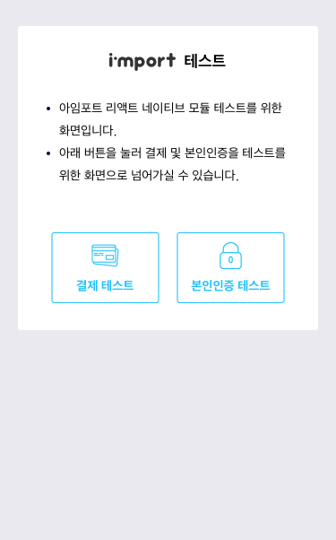
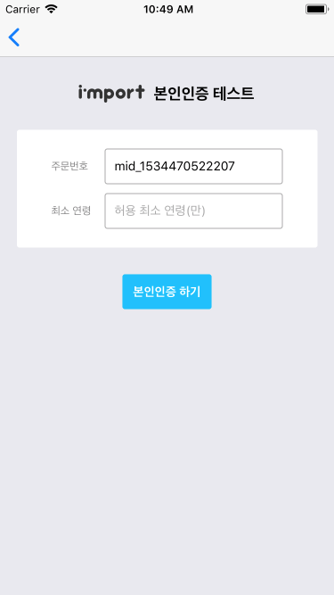

# 예제 프로젝트

아임포트 리액트 네이티브 모듈 예제 안내입니다.

#### IOS에 예제 프로젝트 설치하기
##### 1. 디바이스
  - [XCode를 설치](https://developer.apple.com/xcode)합니다.
  - IOS 디바이스를 컴퓨터에 연결합니다.
  - XCode 프로젝트(`[...]/node_modules/iamport-react-native/example/ios/example.xcodeproj`)를 더블클릭해 오픈합니다.
  - `Cmd+R`를 눌러 앱을 빌드합니다.
  - 빌드가 성공하고 디바이스에 example 앱이 설치된 것을 확인하실 수 있습니다.

##### 2. Emulator
  - 아래 명령어를 입력해 IOS emulator를 실행시켜 아임포트 모듈 결제테스트를 진행하실 수 있습니다.
  ```
  $ cd [...]/node_modules/iamport-react-native/example
  $ npm install
  $ react-native run-ios
  ```

#### 안드로이드에 예제 프로젝트 설치하기
##### 1. 디바이스
  - 안드로이드 디바이스를 컴퓨터에 연결합니다.
  - 아래 명령어를 입력해 앱을 빌드합니다.
    ```
    $ cd [...]/node_modules/iamport-react-native/example
    $ npm install
    $ react-native run-android
    ```
  - 빌드가 성공하고 example 앱이 디바이스에 설치된 것을 확인하실 수 있습니다.

##### 2. Emulator
  - [안드로이드 스튜디오를 설치](https://developer.android.com/studio)합니다.
  - 안드로이드 프로젝트(`[...]/node_modules/iamport-react-native/example/android`)를 안드로이드 스튜디오에서 오픈합니다.
  -  또는 `Cmd+F9`를 눌러 앱을 빌드합니다.
  - 을 눌러 안드로이드 emulator를 실행시킵니다.
  - example 앱이 설치된 것을 확인하실 수 있습니다.






#### 일반/정기결제 코드 작성 예시
```javascript
import React from 'react';
/* 아임포트 결제모듈을 불러옵니다. */
import IMP from 'iamport-react-native';

/* 로딩 컴포넌트를 불러옵니다. */
import Loading from './Loading';

export function Payment({ navigation }) {
  /* [필수입력] 결제 종료 후, 라우터를 변경하고 결과를 전달합니다. */
  function callback(response) {
    navigation.replace('PaymentResult', response);
  }

  /* [필수입력] 결제에 필요한 데이터를 입력합니다. */
  const data = {
    pg: 'html5_inicis',
    pay_method: 'card',
    name: '아임포트 결제데이터 분석',
    merchant_uid: `mid_${new Date().getTime()}`,
    amount: '39000',
    buyer_name: '홍길동',
    buyer_tel: '01012345678',
    buyer_email: 'example@naver.com',
    buyer_addr: '서울시 강남구 신사동 661-16',
    buyer_postcode: '06018',
    app_scheme: 'example',
    // [Deprecated v1.0.3]: m_redirect_url
  };

  return (
    <IMP.Payment
      userCode={'iamport'}    // 가맹점 식별코드
      loading={<Loading />}   // 로딩 컴포넌트
      data={data}             // 결제 데이터
      callback={callback}     // 결제 종료 후 콜백
    />
  );
}

export default Payment;
```

| Prop             | Type          |  Description                                                | Required   |
| ---------------- | ------------- | ----------------------------------------------------------- | ---------- |
| userCode         | string        | 가맹점 식별코드                                                 | true       |
| data             | object        | 결제에 필요한 정보 [자세히 보기](https://docs.iamport.kr/tech/imp) | true       |
| - m_redirect_url | string        | [Deprecated]                                                | false       |
| callback         | function      | 결제 후 실행 될 함수 [자세히보기](#callback)                       | true       |
| loading          | RN 컴포넌트     | 웹뷰 로드시 보여질 컴포넌트                                        | false      |


#### 휴대폰 본인인증 코드 작성 예시
```javascript
import React from 'react';
/* 아임포트 본인인증 모듈을 불러옵니다. */
import IMP from 'iamport-react-native';

/* 로딩 컴포넌트를 불러옵니다. */
import Loading from './Loading';

export function Certification({ navigation }) {
  /* [필수입력] 본인인증 종료 후, 라우터를 변경하고 결과를 전달합니다. */
  function callback(response) {
    navigation.replace('CertificationResult', response);
  }

  /* [필수입력] 본인인증에 필요한 데이터를 입력합니다. */
  const data = {
    merchant_uid: `mid_${new Date().getTime()}`,
    company: '아임포트',
    carrier: 'SKT',
    name: '홍길동',
    phone: '01012341234',
    min_age: '',
  };

  return (
    <IMP.Certification
      userCode={'iamport'}    // 가맹점 식별코드
      loading={<Loading />}   // 로딩 컴포넌트
      data={data}             // 본인인증 데이터
      callback={callback}     // 본인인증 종료 후 콜백
    />
  );
}

export default Certification;
```

| Prop          | Type          |  Description                       | Required   |
| ------------- | ------------- | ---------------------------------- | ---------- |
| userCode      | string        | 가맹점 식별코드                        | true       |
| data          | object        | 본인인증에 필요한 정보 [자세히 보기](https://https://docs.iamport.kr/tech/mobile-authentication#call-authentication)      | true       |
| - merchant_uid| string        | 가맹점 주문번호                        | false      |
| - company     | string        | 회사명 또는 URL                       | false      |
| - carrier     | string        | 통신사                               | false      |
| - name        | string        | 본인인증 할 이름                        | false      |
| - phone       | number        | 본인인증 할 전화번호                     | false      |
| - min_age     | number        | 본인인증 허용 최소 연령                  | false      |
| callback      | function      | 본인인증 후 실행 될 함수                 | true       |
| loading       | RN 컴포넌트     | 웹뷰 로드시 보여질 컴포넌트               | false      |

#### 웹뷰 로딩 컴포넌트 코드 작성 예시
웹뷰가 로드되기 전 보여질 로딩 화면을 컴포넌트로 생성해 loading 파라메터로 넘깁니다. 미 입력시 아임포트가 보여주는 default 로딩 페이지가 렌더링됩니다. 아래는 로딩 컴포넌트 코드 작성 예시입니다.

```javascript
import React from 'react';
import { View, Text, StyleSheet } from 'react-native';

export function Loading() {
  const { container } = styles;
  return (
    <View style={container}>
      <Text>잠시만 기다려주세요...</Text>
    </View>  
  );
}

const styles = StyleSheet.create({
  container: {
    ...StyleSheet.absoluteFillObject,
  },
});

export default Loading;
```

로딩 컴포넌트를 감싸고 있는 최상단 View 컴포넌트의 스타일 속성을 지정할때 주의해야합니다. 별도의 설정 없이 작성할 경우, 로딩 컴포넌트는 전체 화면의 절반만 차지하게 됩니다. 이는 react-native-webview 모듈 자체의 이슈로, 스타일 속성을 지정할때 위 예시와 같이 `StyleSheet.absoluteFillObject`값을 추가해주면 됩니다. 자세한 내용은 [Fix: Flex loading view](https://github.com/react-native-community/react-native-webview/pull/663)를 참고해주세요.
