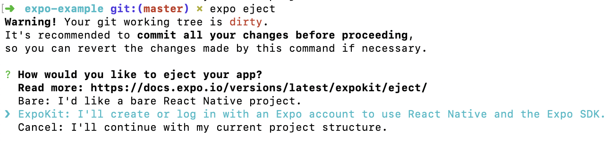

# 엑스포에서 아임포트 연동하기
엑스포 환경에서 아임포트 모듈을 연동하려면 반드시 EJECT 하셔야 합니다. 아임포트 모듈이 네이티브단 코드를 포함하고 있기 때문입니다. 아래는 엑스포 환경에서 EJECT를 통해 아임포트 모듈을 연동하는 방법에 대해 안내합니다. 해당 안내는 엑스포 공식문서 [Ejecting to ExpoKit](https://docs.expo.io/versions/latest/expokit/eject/)를 기반으로 작성했습니다.

## 1. 엑스포 CLI 설치하기
```
$ npm install -g expo-cli
```

## 2. 설정 파일(app.json) 확인하기

원활한 ejecting을 위해 아래와 같이 설정되어 있는지 확인합니다.

```
// app.json
{
  "expo": {
    "name": "Your App Name",
    "icon": "./path/to/your/app-icon.png",
    "version": "1.0.0",
    "slug": "your-app-slug",
    "sdkVersion": "XX.0.0",
    "ios": {
      "bundleIdentifier": "com.yourcompany.yourappname"
    },
    "android": {
      "package": "com.yourcompany.yourappname"
    }
  }
}
```

- IOS의 `bundleIdentifier`값과 Android의 `package`값에 알맞은 값을 넣어야 합니다.
- `name`, `icon` 그리고 `version` 필드는 필수입력입니다.
- 보다 자세한 내용은 엑스포 공식문서 [Configure app.json](https://docs.expo.io/versions/latest/distribution/building-standalone-apps/#2-configure-appjson)을 참고해주세요.

## 3. EJECT 하기

프로젝트 폴더에서 expo 명령어를 통해 eject 합니다. android와 ios 폴더가 생성되며 필요한 dependency들이 설치됩니다.

```
$ expo eject
```

위 명령어를 실행하면 아래와 같은 내용이 출력됩니다.



두번째 `ExpoKit: I'll create or log in with an Expo account to use React Native and the Expo SDK.`를 선택합니다. 이후 모든 과정은 아임포트 RN 모듈 사용법과 동일합니다. 

## 4. [아임포트 설치 및 링킹하기](./INSTALL.md)
```
$ npm install --save iamport-react-native
$ npm install --save react-native-webview@7.0.5 // EXPO와 호환되는 최신 버전 7.0.5 설치
$ react-native link iamport-react-native
```

## 5. 설정하기
  - [IOS 설정하기](./SETTING.md)
  - [실시간 계좌이체 설정하기](./TRANS.md)

## 6. [예제](./EXAMPLE.md)

- [예제 코드 작성하기](./EXAMPLE.md)
- [예제 프로젝트 실행하기](../exampleForExpo/README.md)

## 7. [콜백 함수 설정하기](./CALLBACK.md)
