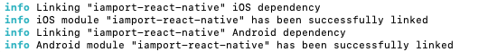

# 설치하기
아임포트 리액트 네이티브 모듈 설치 안내입니다. 아래 명령어를 통해 아임포트 모듈을 귀하의 리액트 네이티브 프로젝트에 추가할 수 있습니다.

```
$ npm install iamport-react-native --save
$ npm install react-native-webview --save // RN v0.60 이상 필수
```

아래 다음 명령어를 통해 아임포트 모듈을 귀하의 안드로이드/IOS 프로젝트에 추가할 수 있습니다.

```
$ npm install -g react-native-cli
$ react-native link iamport-react-native
$ react-native link react-native-webview
```

성공적으로 마쳤을 경우, 아래와 같은 화면을 보실 수 있습니다.




실패한 경우, 아래 과정을 통해 iamport-react-native 모듈을 귀하의 프로젝트에 [수동으로 연결](https://facebook.github.io/react-native/docs/linking-libraries-ios)시킬 수 있습니다.

#### IOS

1. XCode 프로젝트(`[...]/ios/[...].xcodeproj`)를 더블클릭해 오픈합니다.
2. 왼쪽 프로젝트 네비게이터에서, `Libraries` 폴더를 마우스 오른쪽 클릭 ➜ `Add Files to [your project's name]`를 클릭합니다.
3. `[...]/node_modules/iamport-react-native/ios/IamportReactNative.xcodeproj`와 `[...]/node_modules/react-native-webview/ios/RNCWebView.xcodeprof`를 선택해 추가합니다.
4. 왼쪽 프로젝트 네비게이터에서, 귀하의 타깃을 클릭 ➜ 오른쪽 상단 `Build Phases`를 클릭합니다.
5. 세번째 메뉴인 `Link Binary With Libraries`를 열어 `libIamportReactNative.a` 파일과 `libRNCWebView.a` 파일을 추가합니다.

#### 안드로이드

1. `android/app/src/main/java/[...]/MainApplication.java` 파일을 열어 아래 코드를 추가합니다.
  ```java
  import com.iamport.IamportPackage; // 아임포트 패키지를 불러옵니다.

  ...

  @Override
  protected List<ReactPackage> getPackages() {
    return Arrays.<ReactPackage>asList(
        new MainReactPackage(),
          new IamportPackage(), // 아임포트 패키지를 추가합니다.
          new RNCWebViewPackage(), // 리액트 네이티브 웹뷰 패키지를 추가합니다.
    );
  }
  ```

2. `android/settings.gradle` 파일을 열고 아래 코드를 추가합니다.
  ```java
  ...

  include ':iamport-react-native'
  project(':iamport-react-native').projectDir = new File(rootProject.projectDir,  '../node_modules/iamport-react-native/android')
  include ':react-native-webview'
  project(':react-native-webview').projectDir = new File(rootProject.projectDir, '../node_modules/react-native-webview/android')

  ...
  ```

3. `android/app/build.gradle` 파일을 열고 아래 코드를 추가합니다.
  ```java
  dependencies {
    ...

    implementation project(':iamport-react-native')
    implementation project(':react-native-webview')

    ...
  }
  ```