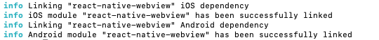

# 설치하기
아임포트 리액트 네이티브 모듈 설치 안내입니다.
아래 명령어를 통해 아임포트 모듈을 귀하의 리액트 네이티브 프로젝트에 추가할 수 있습니다.
`react-native-webview` 모듈은 아임포트 모듈을 사용하기 위해 꼭 필요하기 때문에 반드시 함께 설치해야 합니다.

```shell
$ npm install iamport-react-native --save
$ npm install react-native-webview --save
```
또는
```shell
$ yarn add iamport-react-native
$ yarn add react-native-webview
```

`iamport-react-native`는 `v10.8.3` 이상의 `react-native-webview`를 필요로 합니다.
위 명령어대로 `iamport-react-native` 플러그인을 설치했을 때 다음과 같은 Warning Message가 나온다면 기존에 설치된 `react-native-webview` 플러그인을 업데이트해주세요.


`react-native` `v0.60.0` 부터는 auto linking 및 jetifier 자동 적용이 지원됩니다.
다만 자동으로 링크가 되어도 iOS의 경우 `pod install`은 직접 실행해주셔야 합니다.

구 버전의 `react-native`를 사용하신다면 업데이트해주셔야 별도의 링크 작업 없이 아임포트 모듈을 사용하실 수 있습니다.

설치를 성공적으로 마쳤을 경우, 아래와 같은 화면을 보실 수 있습니다.




[comment]: <> (실패한 경우, 아래 과정을 통해 `iamport-react-native` 모듈을 귀하의 프로젝트에 [수동으로 연결]&#40;https://facebook.github.io/react-native/docs/linking-libraries-ios&#41;시킬 수 있습니다.)
